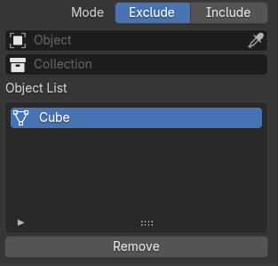

# UI Templates framework

UI Templates ( aka controls ) encapsulate the UI representation and export mechanics for a set of plugin properties. A template could be used with different plugins to provide the same functionality.

A template operates on a set of predefined plugin property types. The specific properties are bound to the template through the plugin description file. A dedicated property type 'TEMPLATE' is used to mark a meta property as a template.

Templates should register a class derived from bpy.types.PropertyGroup which can be instantiated by Blender as a plugin property. This class should provide drawing into a layout and export of the bound plugin properties into a PluginDesc. 

NOTE: Templates are only used for drawing UI in property pages. For drawing node sockets, the same functionality is provided by custom socket classes.

Templates are instantiated and registered at add-on load time. For each template, an function that returns the template's class should be added to plugins/templates/\_\_init__.py. The name of this access function is used in the plugin description to find the template class.

### Generic template description

```json
{
    "Parameters": {
        "attr": "some_property",
        "type": "TEMPLATE",
        "options": {
            "template": {
                "type": "templateAccessFunction",
                "custom_exporter": false,
                "args": {
                    "bound_property": "exclude_list",
                    "another_bound_property": "use_exclude_list", 
                    ... any other properties the template might need
                }
            }
        }
    }
}
```

* `type` is always "TEMPLATE"
* `custom_exporter` set to true to skip the default export procedure and rely on custom export code. This is necessary in order to prevent the default export procedure from overwriting any data exported by the custom export. 
* `template.type` is the name of the access function in templates/__init__.py
* `template.args` is a dictionary of arbitrary values

The registration procedure will always register two properties for each template, which can be used by the template to access its own description in any context:
- `vray_plugin` - the type of the plugin the template is instantiated for.
- `vray_attr` - the name of the template plugin attribute.


## A list of available templates

**NOTE:** See the template class help strings for description of supported template properties.

### TemplateMultiObjectSelect 


Selection of multiple scene objects or materials. Both objects and collections can be shown to select from. The list can be filtered to show only the relevant item types. 

**Exports:** a list of objects.


Select a single scene objects or material. The list can be filtered to show only the relevant item types. 

**Exports:** an object.

### TemplateIncludeExcludeList 



A template for selecting multiple scene objects or materials. Based on TemplateMultiObjectSelect, this template adds an Include / Exclude selector.

**Exports:** a list of objects and an include/exlcude flag.

### TemplateSelectGeometries 

NOTE: This is a special template which is designed to be used only in code (as a property type) and does not need a plugin description. Use it as a building block for more complex UI. Example: VRayLight.objectList property


A template for selecting multiple scene objects or materials. Based on TemplateMultiObjectSelect, this template adds an Include / Exclude selector.

**Exports:** not implemented. The host should call template's methods to obtain the export data.


 